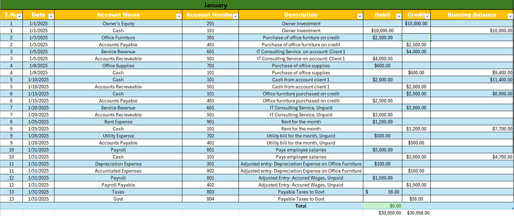
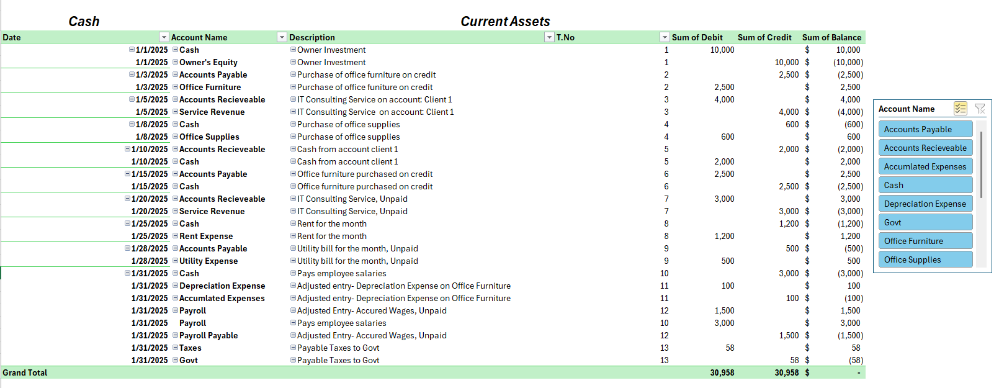

Excel Accounting Cycle Simulation
--------------

Project Overview
----------------
This project simulates the complete accounting cycle using Microsoft Excel.
The workbook demonstrates how financial transactions move through the accounting process from journal entries to financial statements.

The goal of this project is to demonstrate understanding of core accounting workflows used in business finance and accounting departments.

Accounting Cycle Covered
----------------------
The workbook includes the following accounting stages:

1. Chart of Accounts

2. Journal Entries

3. General Ledger

4. Trial Balance

5. Income Statement

6. Statement of Owner's Equity

7. Balance Sheet

Data Organization
-----------------
The workbook is organized into multiple sheets representing different stages of the accounting process.

Example structure:

Chart_of_Accounts
Journal_Entries
General_Ledger
Trial_Balance
Income_Statement
Owners_Equity
Balance_Sheet

Each sheet connects financial data across the accounting workflow.

Tools Used
---------
Software: Microsoft Excel

Excel Features

Pivot Tables for summarizing financial transactions

Data organization across linked worksheets

Financial statement formatting

Spreadsheet-based accounting modeling

Excel Functions

SUM — aggregation of account balances

XLOOKUP — retrieving account data across sheets

IF statements — validating transaction logic

Data validation — structured data entry

Accounting Concepts Demonstrated

This project demonstrates several core accounting principles including:

Debit and credit journal entry structure

Posting transactions to the general ledger

Trial balance reconciliation

Financial statement preparation

Financial data organization

Purpose
-------------
This project was created as part of accounting coursework to demonstrate practical understanding of financial accounting processes and financial record management.

-------------

